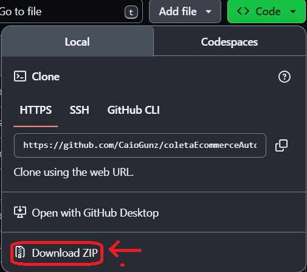
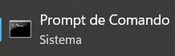
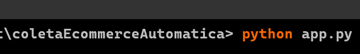

# Coleta Ecommerce Automatica 

Este projeto foi feito para realizar a coleta de dados de anuncios e anunciantes dos principais Ecommerces do Brasil que são **Mercado Livre, Amazon e Shopee**. No momento temos apenas a pagina do Mercado Livre funcionando. Para instalar e descobrir como utilizar o aplicativo você deve entrar neste link e ler a documentação: [**Documentação do Aplicativo**](https://caiogunz.github.io/coletaEcommerceAutomatica/)

## Como baixar e instalar(usar):

No momento ainda não temos executavel, entçao você deve baixar ou clonar a pasta com os arquivos do github e executar o script app.py para inicar o sistema. Se prefirir olhe o passo a passo na [documentação](https://caiogunz.github.io/coletaEcommerceAutomatica/).

### Baixar arquivos

Para baixar os arquivos você deve seguir os seguintes passos:

1. Ao entrar no site você deve identificar esse botão com nome de **<> Code**   ao clicar neste botão você tera acesso ao botão de **DownLoad ZIP** como na imagem a baixo e assim baixar o aplicativo:

    

2. Para executar o aplicativo você deve abrir um terminal **CMD ou PowerShell**. Para abrir um **CMD** va no seu menu inicicar e escreva CMD e clique. Essa imagem mostra qual aplicativo é .

3. Após abrir o cmg, você deve verificar o caminho do arquivo e entrar na pasta onde está o **app.py**, você pode copiar o caminho da pasta e executar esse comando no terminal: **cd seu/caminho** assim o terminar ira para o caminho onde está o arquivo.

4. Estando dentro da pasta que contem o arquivo **app.py** basta executar o comando no terminal: **python app.py** que irá abrir o alicativo e você pode realizar sua pesquisa normalmente. A imagem a seguir mostra como deve ser:

    

