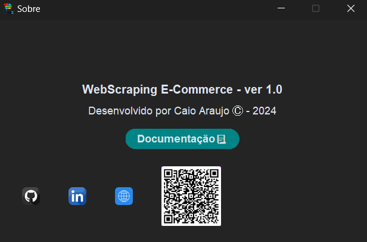

<!-- # Coleta Ecommerce Automatica  -->

# Sobre o Aplicativo

Este projeto foi feito para realizar a coleta de dados de anuncios e anunciantes dos principais Ecommerces do Brasil que são **Mercado Livre, Amazon e Shopee**. No momento temos apenas a pagina do Mercado Livre funcionando.

# Como baixar e instalar(usar):

Para baixar os arquivos você deve seguir os seguintes passos:

1. Ao entrar no site você deve identificar esse botão com nome de **<> Code**   ao clicar neste botão você tera acesso ao botão de **DownLoad ZIP** como na imagem a baixo e assim baixar o aplicativo:

    

2. Para executar o aplicativo você deve abrir um terminal **CMD ou PowerShell**. Para abrir um **CMD** va no seu menu inicicar e escreva CMD e clique. Essa imagem mostra qual aplicativo é .

3. Após abrir o cmg, você deve verificar o caminho do arquivo e entrar na pasta onde está o **app.py**, você pode copiar o caminho da pasta e executar esse comando no terminal: **cd seu/caminho** assim o terminar ira para o caminho onde está o arquivo.

4. Estando dentro da pasta que contem o arquivo **app.py** basta executar o comando no terminal: **python app.py** que irá abrir o alicativo e você pode realizar sua pesquisa normalmente. A imagem a seguir mostra como deve ser:

    

## Imagens do Aplicativo

As telas são divididas em uma tela principal, uma tela para cada tipo de pesquisa e uma tela de help com informações do App:

**Tela Inicial:**

**Tela Sobre:**

**Tela Pesquisa Mercado Livre:**

**Tela Pesquisa Amazon:**

Está em construção!!

## Modo de usar o aplicativo

Para usar o aplicativo você deve escolher primeiramente qual pesquisa de ecommerce vai fazer. Lembrando que os arquivos gerados nessa pesquisa vai estar dentro da pasta mãe do aplicativo.

## Pesquisa Mercado Livre

### Pesquisa de Anúncios

Para iniciar a pesquisa de anúncios você deve seguir os passos abaixo.

1. Você deve ter um link do quantos anúncios pretende fazer o primeiro mapeamento, esse link deve ser da página de anúncios igual a página abaixo:

    
    *Imagen Ilustrativa

    Está página contém varios anúncios então a primeira etapa é fazer esta pesquisa e coletar este **link** que esta entre vermelho (Deve ser o link da sua pesquisa e não igual a imagem)

2. O próximo passo é inserir esse link no local correspondente a pesquisa no aplicativo, na imagem a seguir mostra o local correto:

    

3. Após inserido o link você deve colocar a qual **categoria** o produto pesquisado pertence. **Exemplo: SMARTPHONE** para uma pesquisa sobre celulares. Na imagem a seguir mostra o local onde deve ser escrito a categoria:

    

4. Feito os passos anteriores basta clicar no botão de **Inicia Pesquisa de Anuncios** para iniciar a pesquisa dos anúncios em todas as páginas. Botão na foto a seguir:

    

Com isso ira iniciar a pesquisa e quando terminar vai gerar um **CVS** com o nome de **pesquisaAnunciosMercadoLivre.csv** com os anuncios coletados e a categoria no formato: **link;categoria**

### Pesquisa Anunciante

Para iniciar a pesquisa de anunciantes você deve seguir o passo a passo da pesquisa de anuncios que vai gerar um arquivo **CSV** e com este arquivo gerado vai ser realizada a pesquisa de cada pagina de anúncio que foi coletado no processo anterior. 

Essa pesquisa vai gerar um **CSV** com as seguintes colunas coletadas da página: ***titulo;preco;qtdVendida;linkVendedor;classificacaoVendedor;marca;sku;categoria;link***. Com essas informações é possivel gerar análise de como sua marca está no ecommerce

1. Para inicar a pesquisa de anunciantes você deve checar a existência do arquivo **pesquisaAnunciosMercadoLivre.csv** e caso ele exista e esteja correto basta clicar no botão **Inicia Pesquisa de Anunciante** para dar inicio a pesquisa da pagina. A foto a seguir mostra qual botão deve ser clicado:

    

    Página exemplo do que é mapeado:

    
    Este é um exemplo da página que vai ser mapeada na pesquisa (Imagem Ilustrativa).

    Exemplo do CSV gerado na Pesquisa de Anunciante:

    

    Este é um exemplo de como vai ser o CSV depois de gerado(Imagem Ilustrativa).

    Como você pode verificar na imagem acima, é importante fazer uma limpeza nos dados por conta de alguns dados estarem preenchidos de forma incorreta no site do Mercado Livre, como por exemplo algumas pontuações fora de ordem ou erradas principalmente nas colunas **MARCA E SKU**, então pode ser necessario uma limpeza e validação dos dados para que não ocorra problemas na análise.

